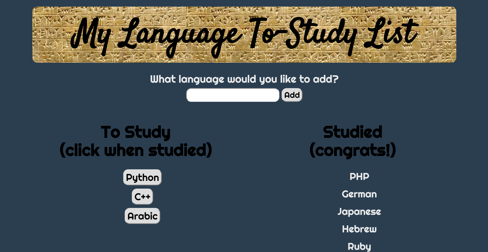

# My Language To-Learn List
This full-stack application allows users to keep track of languages they wish to study, both human and computer. As he/she studies each language, it can be switched to a 'studied' list. Users can add new languages with ease.

## See it in action.

The following shows how the application functions: user types in a new language, adds it to the list, and is able to switch the language to 'studied' once he or she has learned it.

## Built With
Handlebars, mySQL, Node.js (with Express), CSS

## Author
Seton Raynor
